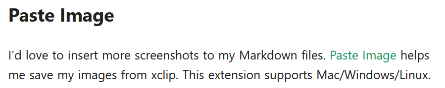

# Table of Contents

- [Table of Contents](#table-of-contents)
- [Algorithms](#algorithms)
  - [Searching](#searching)
    - [Binary Search](#binary-search)
      - [Lower Bound](#lower-bound)
      - [Upper Bound](#upper-bound)
      - [Index of First Occurrence of Element](#index-of-first-occurrence-of-element)
      - [Index of Last Occurrence of Element](#index-of-last-occurrence-of-element)
      - [Number of Times a Sorted Array is Rotated](#number-of-times-a-sorted-array-is-rotated)
      - [Searching in a rotated sorted array](#searching-in-a-rotated-sorted-array)
      - [Minimum Difference Element in a Sorted Array](#minimum-difference-element-in-a-sorted-array)
  - [Subarrays](#subarrays)
    - [Prefix Sum](#prefix-sum)
    - [Partial Sum](#partial-sum)
- [Miscellaneous Algorithms](#miscellaneous-algorithms)
  - [Efficient Integer Swapping Algorithm using XOR](#efficient-integer-swapping-algorithm-using-xor)
  - [Rotating An Array](#rotating-an-array)
    - [Clockwise Rotation](#clockwise-rotation)
    - [Anticlockwise Rotation](#anticlockwise-rotation)

# Algorithms

- This contains common algorithms and their code
- Written in java

## Searching

### Binary Search

- The playlist to follow : https://www.youtube.com/playlist?list=PL_z_8CaSLPWeYfhtuKHj-9MpYb6XQJ_f2

```java
// This code returns index if the target is found else it returns -1
public int binary_search(int arr[], int target){
    int start = 0, end = arr.length - 1;
    while(start <= end){
        int mid = start + (end - start) / 2;
        if(arr[mid] == target)
            return mid;
        if(arr[mid] > target)
            end = mid - 1;
        else
            start = mid + 1;
    }
    return -1; // Element not found
}
```

#### Lower Bound

- Lower Bound is defined as `maximum element which is <= target element`
- The logic is straightforward
  - Keep on doing binary search
  - If target is found, return target
  - whenever an element less than target is found, store its index and continue the binary search
- When the binary search gets exhausted, we will have the lower_bound element

```java
/* Lower Bound = https://youtu.be/5cx0xerA8XY */
public int lower_bound(int arr[], int target){
    int start = 0, end = arr.length - 1;
    int res = -1;
    while(start <= end){
        int mid = start + (end - start)/2;
        if(arr[mid] == target)
            return mid;
        if(arr[mid] < target){
            res = mid;
            start = mid + 1;
        }
        else
            end = mid - 1;
    }
    return res;
}
```

#### Upper Bound

- Upper Bound is defined as `minimum element which is >= target element`
- The logic is straightforward
  - Keep on doing binary search
  - If target is found, return target
  - Whenever an element greater than target is found, store its index and continue the binary search
- When the binary search gets exhausted, we will have the upper_bound element

```java
/* Upper Bound = https://youtu.be/uiz0IxPCUeU */
public int upper_bound(int arr[],int target){
    int start = 0, end = arr.length - 1;
    int res = -1;
    while(start <= end){
        int mid = start + (end - start) / 2;
        if(arr[mid] == target)
            return mid;
        if(arr[mid] > target){
            res = mid;
            end = mid - 1;
        }
        else
            start = mid + 1;
    }
    return res;
}
```

#### Index of First Occurrence of Element

- This is applicable when the `target` element is repeated (exists more than once)
- The logic is to keep applying binary search while moving as "left" as possible
- Since the array is sorted, the elements are adjacent to each other
  - If we encounter an element, we update the answer (which stores the index of occurrence)
  - After this, we move left (`end = mid - 1`) because the first occurrence of element will be towards left
  - Keep on doing this until the binary search is exhausted
- Code

```java
// https://youtu.be/zr_AoTxzn0Y
public int first_occurence_bs(int arr[], int target){
    int start = 0, end = arr.length - 1;
    int res = -1;
    while(start <= end){
        int mid = start + (end - start) / 2;
        if(arr[mid] == target){
            res = mid;
            end = mid - 1;
        }
        else if(arr[mid] > target)
            end = mid - 1;
        else
            start = mid + 1;
    }
    return res;
}
```

#### Index of Last Occurrence of Element

- This is applicable when the `target` element is repeated (exists more than once)
- The logic is to keep applying binary search while moving as "right" as possible
- Since the array is sorted, the elements are adjacent to each other
  - If we encounter an element, we update the answer (which stores the index of occurrence)
  - After this, we move right (`start = mid + 1`) because the last occurrence of element will be towards right
  - Keep on doing this until the binary search is exhausted
- Code

```java
// https://youtu.be/zr_AoTxzn0Y
public int last_occurrence_bs(int arr[], int target){
    int start = 0, end = arr.length - 1;
    int res = -1;
    while(start <= end){
        int mid = start + (end - start) / 2;
        if(arr[mid] == target){
            res = mid;
            start = mid + 1;
        }
        else if(arr[mid] < target)
            start = mid + 1;
        else
            end = mid - 1;
    }
    return res;
}
```

#### Number of Times a Sorted Array is Rotated

> First, learn how to rotate an array. Refer to [Rotating an array clockwise](#clockwise-rotation) and [Rotating an array anti clockwise](#anticlockwise-rotation)

- Let us have an original sorted array as `{2,5,7,9,12,15,23,30,45}`
- Rotations of this sorted array are as follows
  - In the below case, length = `n = 9`

| Count | Clockwise                | Anti clockwise           |
| ----- | ------------------------ | ------------------------ |
| 0     | {2 5 7 9 12 15 23 30 45} | {2 5 7 9 12 15 23 30 45} |
| 1     | {45 2 5 7 9 12 15 23 30} | {5 7 9 12 15 23 30 45 2} |
| 2     | {30 45 2 5 7 9 12 15 23} | {7 9 12 15 23 30 45 2 5} |
| 3     | {23 30 45 2 5 7 9 12 15} | {9 12 15 23 30 45 2 5 7} |
| 4     | {15 23 30 45 2 5 7 9 12} | {12 15 23 30 45 2 5 7 9} |
| 5     | {12 15 23 30 45 2 5 7 9} | {15 23 30 45 2 5 7 9 12} |
| 6     | {9 12 15 23 30 45 2 5 7} | {23 30 45 2 5 7 9 12 15} |
| 7     | {7 9 12 15 23 30 45 2 5} | {30 45 2 5 7 9 12 15 23} |
| 8     | {5 7 9 12 15 23 30 45 2} | {45 2 5 7 9 12 15 23 30} |
| 9     | {2 5 7 9 12 15 23 30 45} | {2 5 7 9 12 15 23 30 45} |

- There is an interesting pattern

| Rotation                 | Clockwise Rotations | Anti clockwise Rotations |
| ------------------------ | ------------------- | ------------------------ |
| {2 5 7 9 12 15 23 30 45} | 0                   | 9                        |
| {45 2 5 7 9 12 15 23 30} | 1                   | 8                        |
| {30 45 2 5 7 9 12 15 23} | 2                   | 7                        |
| {23 30 45 2 5 7 9 12 15} | 3                   | 6                        |
| {15 23 30 45 2 5 7 9 12} | 4                   | 5                        |
| {12 15 23 30 45 2 5 7 9} | 5                   | 4                        |
| {9 12 15 23 30 45 2 5 7} | 6                   | 3                        |
| {7 9 12 15 23 30 45 2 5} | 7                   | 2                        |
| {5 7 9 12 15 23 30 45 2} | 8                   | 1                        |
| {2 5 7 9 12 15 23 30 45} | 9                   | 0                        |

- An interesting pattern emerges

  - Number of Clockwise rotations = `Index of Minimum element`
  - Number of anticlockwise rotations = `length(array) - Number of clockwise rotations`

- Finding index of minimum element through binary search (n = length_of_array)
  - The criteria for minimum element is that it is smaller than both of its adjoining elements
    - To calculate index of previous element, use `(n + index - 1) % n`
    - To calculate index of next element, use `(index + 1) % n`
    - if `arr[prev] > arr[index] && arr[next] > arr[index]`, then `index` is the `min_index`
  - To decide where should the search be conducted next
    - To check whether left half is sorted or not, we check whether the current element is greater than the first element or not. If it is, then it means that the right half of the array is unsorted and therein lies the minimum element
    - To check whether right half is sorted or not, we check whether the current element is lesser than the end element or not. If it is, then it means that the left half of the array is unsorted and therein lies the minimum element

> If the array (or subarray) is not rotated, then `arr[end] > arr[start]`. This means that the array (or subarray) is already sorted and thus, the minimum index is `start`

```java
class Solution{
    public int cw_rotation_count(int arr[]){
        int start = 0, end = arr.length - 1;
        int n = arr.length;
        while(start <= end){
            // If array is not rotated
            if(arr[end] > arr[start])
                return start;

            int mid = start + (end - start) / 2;
            int prev = (n + (mid - 1))%n, next = (mid + 1)%n;

            if(arr[mid] < arr[prev] && arr[mid] < arr[next])
                return mid;
            if(arr[mid] >= arr[start])
                start = mid + 1;
            else
                end = mid - 1;
        }
        return -1;
    }


    public int acw_rotation_count(int arr[]){
        return arr.length - cw_rotation_count(arr);
    }

}
```

#### Searching in a rotated sorted array

- [Refer to this to get the intution behind the current algorithm : Find index of minimum element](#number-of-times-a-sorted-array-is-rotated)
- [Watch this video lol](https://youtu.be/r3pMQ8-Ad5s)
- The logic is as follows
  - Determine which half of the array is sorted
  - Determine whether the `target` element is present inside this sorted half or not
    - If present, then the new search space is reduced to the sorted half
    - If not, we check for the other half and do the same

```java
class Solution
{

    public int search_rotated(int arr[], int target){
        int start = 0, end = arr.length - 1;
        int res = -1;
        while(start <= end){
            int mid = start + (end - start) / 2;
            if(arr[mid] == target)
                return mid;

            // Check if left half of array is sorted or not
            if(arr[start] <= arr[mid]){
                // Check if target lies in this sorted half
                if(arr[start] <= target && target <= arr[mid])
                    end = mid - 1; // target lies in this half
                else
                    start = mid + 1; // target lies in right hald
            }

            else // right half is sorted
            {
                // Check if target lies in this half or not
                if(arr[mid] <= target && target <= arr[end])
                    start = mid + 1 ; // Answer is in right half
                else
                    end = mid - 1; // Answer lies in left half

            }
        }
        return res;
    }
}
```

#### Minimum Difference Element in a Sorted Array

[Source](https://youtu.be/3RhGdmoF_ac)

- Given a sorted array `arr`, find the index element in the array which has **absolute minimum difference** with the given number `target`
  - arr = {1,2,3,8,10,15} | target = 12 | answer = 4
- This is a really interesting question. There are two things to consider
  - If the `target` already exists in the array, then the index of `target` in the array will be the answer as the minimum absolute difference will be 0
  - If the `target` does not exist in the array, then the answer lies within its adjacent neighbours (if the `target` actually existed)
    - For example, arr = {1,2,3,8,10,15} | target = 12 | answer = 4
      - If `target` existed, the array would be `{1,2,3,8,10,12,15}`
      - Neighbours of 12 = 10,15
      - abs(15 - 12) = 3
      - abs(10 - 12) = 2 => Minimum difference
    - \_This is because in a sorted array, the right adjacent neighbour is greater and left adjacent neighbour is smaller than the element
- The interesting observation is that if a normal binary search is applied, then if the element does not exist, then `start` and `end` index will point to the neighbours of `target` (if the `target` existed in array)
  

`INSERT A DIAGRAM HERE`

```java
class Solution{
    public int abs_diff_ele_index(int arr[], int target){
        int start = 0, end = arr.length - 1;
        while(start <= end){
            int mid = start + (end - start) / 2;
            if(arr[mid] == target)
                return mid;
            if(target > arr[mid])
                start = mid + 1;
            else
                end = mid - 1;
        }
        int n = arr.length;
        // If element > maximum element of array i.e. arr[n-1], then start = n, end = n-1
        start = start % n;
        // If element < minimum element of array i.e. arr[0], then start = 0, end = -1
        end = (end + n) % n;
        if(Math.abs(target - arr[start]) < Math.abs(target - arr[end]) )
            return start; // target - arr[start] gives the least difference
        return end; // This means that target - arr[end] gives the least difference
    }
}
```

## Subarrays

### Prefix Sum

- [Prefix Sum Video](https://youtu.be/Z759sE5JWPI)
- Complexity
  - Time Complexity = O(Q)
  - Space Complexity = O(n)

```java
// Java Code
public class Main{
    public static void main(String args[]){
        int arr[] = {1,4,5,2,6};
        int n = arr.length;
        /* Subarray Sums
            [1] = 1
            [4] = 4
            [5] = 5
            [2] = 2
            [6] = 6
            [1,4] = 5
            [4,5] = 9
            [5,2] = 7
            [2,6] = 8
            [1,4,5] = 10
            [4,5,2] = 11
            [5,2,6] = 13
            [1,4,5,2] = 12
            [4,5,2,6] = 17
            [1,4,5,2,6] = 18
         */
		// Create Prefix Array
        int[] p = new int[n];
        p[0] = arr[0];
        for(int i = 1; i < n; ++i)
            p[i] += p[i-1] + arr[i];

		/* Finding sum of subarrays
            * For 0 based indexing L and R
            * Sum of subarray is defined as p[R] - P[L-1]
            * If L = 0, then sum = P[R]
         */
        // Taking input of L and R
        int L = 1, R = 3; // Subarray = [4,5,2], sum = 11
        System.out.println(p[R] - p[L-1]);
    }
}
```

### Partial Sum

- [Partial Sum Video](https://youtu.be/4GXV2W0y0wA)
- Complexity
  - Time Complexity = O(Q)
  - Space Complexity = O(1) // since we already have `p` as input

```java
// Java Code
import java.util.List;
import java.util.ArrayList;
public class Main{
    public static void main(String args[]){
        /* Partial Sum : https://youtu.be/4GXV2W0y0wA
            * A query of form L R x is given.
            * We need to add x to all elements between arr[L] and arr[R]
            * An optimized way of doing this is to use prefix sum
            * For a query L R x, we will do the following operation on an array p
                * p[L] += x
                * p[R+1] -= x
            * After all the above operations have been performed, we will take prefix sum of p
            * We will then get the final array
         */
        int n = 6;
        int[] p = new int[n];
        ArrayList<List<Integer>> q = new ArrayList<>();
        q.add(List.of(2,4,1));
        q.add(List.of(1,5,3));
        q.add(List.of(0,2,2));
        System.out.println("Array Before");
        printArray(p);
        for(var itr = q.iterator(); itr.hasNext(); )
        {
            List li = itr.next();
            int L = (int)li.get(0), R = (int)li.get(1), x = (int)li.get(2);
            p[L] += x;
            if(R+1 < n)
                p[R+1] -= x;
        }
        // Now take prefix sum
        for(int i =1 ; i < n; ++i)
            p[i] += p[i-1];
        System.out.println("Array after");
        printArray(p);
    }

    public static void printArray(int arr[]){
        for(int num : arr)
            System.out.print(num + " ");
        System.out.println();
    }

}
```

# Miscellaneous Algorithms

## Efficient Integer Swapping Algorithm using XOR

- [Source article](https://betterexplained.com/articles/swap-two-variables-using-xor/)
- The code is as follows

```
x = x XOR y;
y = x XOR y; // equivalent to y = (x XOR y) XOR (y) => y = x
x = x XOR y; // equivalent to x = (x XOR y) XOR (x) => x = y
```

**DO NOT USE THIS IN PRODUCTION LEVEL CODE AND WITH ANY OTHER DATATYPE**

> Quoting the source article

```
Would you really use this?

No way. This is a cool trick, but don’t write this as an actual swap function. If you have to debug it in 6 months you’ll be in for some fun. Let me show you why:

Suppose x and y are pointers or references to objects, and both point to the same location. We’d expect our swapping function to just switch the values around, with no net change, right?

Well, take a look at what happens if we expand out line 1:
x = x xor y
x = x xor x  // x and y are equal
x = 0
Wow! So x becomes 0 right at the get-go. That’s ok by itself, but because x and y are at the same location, we just made y zero as well! We’ve lost the original values, a problem known as aliasing: changing one variable has an indirect effect on another.
```

## All Row and Column Maximum of a 2D Array
The problem statement is that we need to find the maximum values of each row and column in a given 2D array of size `n*m`. To do so, the algorithm is as follows
- `rows` = Number of rows
- `cols` = Number of columns

```java
int[] rowMax = new int[rows] ; Arrays.fill(rowMax,0);
int[] colMax = new int[cols] ; Arrays.fill(colMax,0);

for(int row = 0 ; row < rows; ++row){
    for(int col = 0; col < cols; ++col){
        rowMax[row] = Math.max(rowMax[row], arr[row][col]);
        colMax[col] = Math.max(colMax[col], arr[row][col]);
    }
}
```

## Rotating An Array

### Clockwise Rotation

- [Medium Answer link](https://betterprogramming.pub/3-ways-to-rotate-an-array-2a45b39f7bec)
- [Leetcode Question](https://leetcode.com/problems/rotate-array/)
- The algorithm
  - We are given the array and a variable `k` as input. `k` means "the number of rotations we want in clockwise direction".
  - The value of variable `n = array.length`
  - If `k > n`
    - This will mean that we are doing redundant rotations as the max rotations an array can have is `n`
    - `k = k % n`
  - The first step is to reverse the full array => `reverse(arr,0,n-1)`
  - Then, reverse the array from index 0 to `k-1` => `reverse(arr,0,k-1)`
  - Then reverse the array from index `k` to `n-1` (from k to end) => `reverse(arr,k,n-1)`
- Code is as follows

```java
class Solution {
    public void reverse(int nums[], int start, int end){
        while(start < end){
            // Swapping efficiently using XOR
            // https://betterexplained.com/articles/swap-two-variables-using-xor/
            nums[start] = nums[start] ^ nums[end];
            nums[end] = nums[start] ^ nums[end];
            nums[start] = nums[start] ^ nums[end];
            // Decrement
            ++start; --end;
        }
    }

    public void rotate_cw(int[] nums, int k) {
        int n = nums.length;
        k = k % n;
        // Reverse the full array
        reverse(nums,0,n-1);
        // Reverse from 0 to k
        reverse(nums,0,k-1);
        // Reverse from k+1 to n-1
        reverse(nums,k,n-1);

    }
}
```

### Anticlockwise Rotation

- Dry Run
  - Original Array = 1 2 3 4 5 6 7
  - Result Array = 3 4 5 6 7 1 2
  - k = 2
    - n = 7
    - k = 2

| Initial       | Result        | Operation                              |
| ------------- | ------------- | -------------------------------------- |
| 1 2 3 4 5 6 7 | 1 2 7 6 5 4 3 | reverse k to n-1 => `reverse(arr,2,6)` |
| 1 2 7 6 5 4 3 | 2 1 7 6 5 4 3 | reverse 0 to k-1 => `reverse(arr,0,1)` |
| 2 1 7 6 5 4 3 | 3 4 5 6 7 1 2 | reverse 0 to n-1 => `reverse(arr,2,6)` |

```java
class Solution {
    public void reverse_acw(int nums[], int start, int end){
        while(start < end){
            // Swapping efficiently using XOR
            // https://betterexplained.com/articles/swap-two-variables-using-xor/
            nums[start] = nums[start] ^ nums[end];
            nums[end] = nums[start] ^ nums[end];
            nums[start] = nums[start] ^ nums[end];
            // Decrement
            ++start; --end;
        }
    }

    public void rotate(int[] nums, int k) {
        int n = nums.length;
        k = k % n;
        // Reverse the full array
        reverse(nums,k,n-1);
        reverse(nums,0,k-1);
        reverse(nums,0,n-1);

    }
}
```
