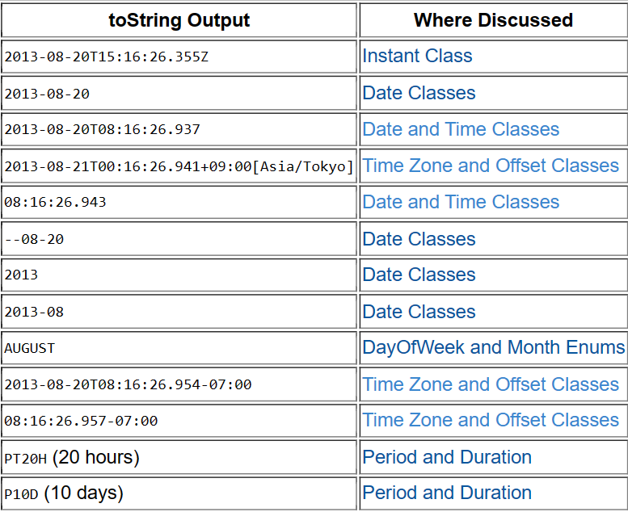

Table of Contents
<!-- TOC -->
* [Quick summary](#quick-summary)
* [LocalDate Class](#localdate-class)
  * [Creating a custom date object](#creating-a-custom-date-object)
  * [Extracting Data from LocalDate object](#extracting-data-from-localdate-object)
<!-- TOC -->

# Quick summary
See the picture below
- Documentation = https://docs.oracle.com/javase/tutorial/datetime/iso/overview.html)
- Java Docs = https://docs.oracle.com/en/java/javase/11/docs/api/java.base/java/time


# LocalDate and LocalDateTimeClass
- Format is `Year-Month-Date`
- Immutable object
- [LocalDate JavaDocs](https://docs.oracle.com/en/java/javase/11/docs/api/java.base/java/time/LocalDate.html)
- [LocalDateTime JavaDocs](https://docs.oracle.com/en/java/javase/11/docs/api/java.base/java/time/LocalDateTime.html)

## Creating a custom date object
- The date format is Year-Month-Day
- We use the LocalDate.of(int year, java.time.Month, int day) method
  - `java.time.Month` is an `enum` class. It contains enum for each month in calendar

```java
LocalDate date1 = LocalDate.of(2025, Month.APRIL, 15);
System.out.println(date1); // Creates a LocalDate object
```

## Extracting Data from LocalDate object

Below are some methods which allow us to retrieve information from an object of LocalDate class. They are as follows
- Note : For more methods, refer to documentation

| Method            | Use                                                | Example                        |
|-------------------|----------------------------------------------------|--------------------------------| 
| `getDayOfWeek()`  | what day it is LocalDate object (example, Tuesday) | Tuesday                        |
| `getDayOfMonth()` | what day in month it is in LocalDate object        | 15th day in a month of 31 days |
| `getDayOfYear()`  | what day in year it is in LocalDate object         | 215th day                      | 
| `lengthOfMonth()` | Length of the month in the LocalDate object        | 31                             |
| `lengthOfYear()`  | Length of year in the LocalDate object             | 365                            |
| `getYear()`       | Gets the year from LocalDate object                | 2025                           |
| `getMonth()`      | Gets the Month from LocalDate object               | APRIL                          |

Example usage : 
```java
System.out.println("Day at date " + date1 + " = " + date1.getDayOfWeek());
System.out.println(date1.getDayOfMonth() + " Days out of " + date1.lengthOfMonth() + " Days");
System.out.println(date1.getDayOfYear() + " Days out of " + date1.lengthOfYear() + " Days");
System.out.println("Is the year " + date1.getYear() + " leap = " + date1.isLeapYear());
```

# LocalDateTime Operations
## Converting between timezones


# Instant Class
- Used when we are dealing with timestamps
- Timestamps are generally expressed in nano seconds
- To use Instant class, we also need to be aware of the Temporal Interface
  - `This (Temporal) is the base interface type for date, time and offset objects that are complete enough to be manipulated using plus and minus.`
  - Useful Enums
    - ChronoUnit : Standard set of date and period units
    - https://docs.oracle.com/javase/8/docs/api/java/time/temporal/ChronoUnit.html
      - SECONDS
      - MINUTES
      - HOURS
      - HALF_DAYS
      - DAYS
      - WEEKS
      - MONTHS
      - YEARS
      - DECADES
      - CENTURIES

Useful Methods

| Method                                                    | Use                                                                             | 
|-----------------------------------------------------------|---------------------------------------------------------------------------------|
| `toString()`                                              | Returns the timestamp in ISO 8601. `YYYY-MM-DDTHH:MM:SS`                        |
| `Instant.now()`                                           | Returns timestamp of current time in UTC                                        |
| `Instant.MAX`                                             | Max time an Instant can hold. CANNOT BE CONVERTED TO LocalDateTime              |
| `Instant.MIN`                                             | Max time an Instant can hold. CANNOT BE CONVERTED TO LocalDateTime              |
| `LocalDateTime.ofInstant(instant,ZoneID.of("UTC"))`       | Converts an Instant object `instant` to a LocalDateTime object (UTC timezone)   |
| `LocalDateTime.ofInstant(instant,ZoneID.systemDefault())` | Converts an Instant object `instant` to a LocalDateTime object (Local Timezone) |
| `plus(long amountToAdd, TemporalUnit unit)`               | Adds `amountToAdd * unit` to the time instant                                   |
| `ldt.toInstant(ZoneOffset.UTC)`                           | Converts a LocalDateTime object `ldt` to an Instant object in UTC               |

