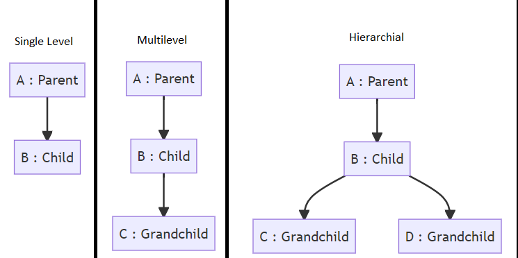

`Table of Contents`

- [Basics](#basics)
  - [TODO : Static](#todo--static)
  - [TODO : Final](#todo--final)
  - [TODO : Enums](#todo--enums)
  - [TODO : Annotations](#todo--annotations)
  - [TODO : Streams](#todo--streams)
- [OOPS Quick RULES](#oops-quick-rules)
  - [Inheritance](#inheritance)
  - [Overriding and Overloading Inherited Methods](#overriding-and-overloading-inherited-methods)
  - [Polymorphism](#polymorphism)
  - [Abstraction](#abstraction)
- [OOPS (Object Oriented Programing Systems)](#oops-object-oriented-programing-systems)
  - [Packages](#packages)
  - [Creation of Classes](#creation-of-classes)
  - [Constructors](#constructors)
  - [Access Modifiers](#access-modifiers)
  - [Inheritance](#inheritance-1)
    - [Types](#types)
    - [Rules](#rules)
    - [Overriding and Overloading Inherited Methods](#overriding-and-overloading-inherited-methods-1)
    - [Java Generics](#java-generics)
    - [TODO : Sealed Classes](#todo--sealed-classes)
  - [Polymorphism](#polymorphism-1)
    - [Typecasting](#typecasting)
    - [instanceOf](#instanceof)
  - [Abstraction](#abstraction-1)
  - [TODO : Interfaces](#todo--interfaces)

# Basics

## TODO : Static

[Static keyword in Java](https://youtu.be/qRCEdWQ0f4Q)

## TODO : Final

[Final keyword in Java](https://youtu.be/WZgcRSWVgpQ)

## TODO : Enums

[Enums in Java](https://www.youtube.com/watch?v=wq9SJb8VeyM)

## TODO : Annotations

- [Hindi](https://youtu.be/jy8Glegc5Xo)
- [English](https://youtu.be/JV0atjBcUv4)

## TODO : Streams

- [Playlist : Streams in Java](https://www.youtube.com/playlist?list=PLUDwpEzHYYLvTPVqVIt7tlBohABLo4gyg)

# OOPS Quick RULES

## Inheritance

**Parent and Child Class**

- A superclass's (parent class) constructor is executed before the subclass (derived class) constructor
- Explicit call to parent class's constructor can be made from the constructor of derived class. It is done by using the `super()` keyword
  - However, this call must be the first line of the constructor
  - Otherwise the program will not work
- If superclass does not have a constructor (explicitly defined default constructor), then the subclass needs to manually invoke the constructor of superclass

**Access Specifiers, functions and constructors**

- Public and Protected fields and methods are inherited by children
- Constructors are not inherited by children
- Private members are not inherited
- Final methods are inherited but cannot be overridden

## Overriding and Overloading Inherited Methods

- Terms
  - Overriding : Same function signature BUT different body
  - Overloading : Different function signature (name is same, parameters are different) and different body
- As a matter of convention, whenever we are overriding a method, use the `@Override` symbol

## Polymorphism

- An object can have a superclass type and subclass instance
- If a method is overridden by subclass, then the polymorphic object will execute the overridden method at runtime

## Abstraction

- Abstract classes and methods are templates that are meant to be implemented by their subclasses
- Classes and methods are declared abstract by using the abstract reserved word
- If a subclass inherits from an abstract class, it must implement its abstract methods or the class itself must be declared as abstract
- Abstract classes cannot be instantiated
- Classes and methods are defined as abstract by using the word "abstract"
  - If a class has an abstract method, then the class must be declared as abstract

# OOPS (Object Oriented Programing Systems)

## Packages

- It is a "folder" where classes can be categorized
- For example, let us assume we have a "folder" / package called "Geometery".
  - In this, various geometrical figures such as Rectangle, Circle, Square etc. can be stored
  - For each geometrical figure, we need to create a separate class
  - However, they all have one thing in common : That they are geometrical figures
  - Therefore, the package "Geometry" becomes a way to group them
- Check this to learn how to work with packages : [Java-Basic-Package-Example by BeardedOwl1357](https://github.com/BeardedOwl1357/Java-Basic-Package-Example)

## Creation of Classes

**The class Object is the superclass to every single class.**

- The general syntax to define a class

```
<access_specifier> class <class_name> extends <parent_1>,<parent_2> ... {
    // Body
}
```

> Note : The `extended` keyword is used for inheritance. Ignore it for now. See the below example

```java
public class Rectangle{
    public double length, breadth;

    public Rectangle(){
        this.length = 0;
        this.breadth = 0;
    }

    public Rectangle(double length, double breadth){
        this.length = length; // this.length is the class / global variable
        this.breadth = breadth; // this.breadth is the class / global variable
    }

    public double getArea(){
        return length*breadth;
    }

    public double getPerimeter(){
        return 2*(length + breadth);
    }

    public double getLength(){
        return length;
    }

    public double getBreadth(){
        return breadth;
    }
}
```

## Constructors

- Method which executes when an object is created
- By default, each class has an empty constructor
- The name of the constructor must be the same as the name of the class

## Access Modifiers

| Modifier    | Visibility                 |
| ----------- | -------------------------- |
| Public      | Everywhere in program      |
| Protected   | In package and subclasses  |
| Private     | Only in the specific class |
| No Modifier | In package                 |

- A good (and essential) practice is to keep attributes (variables) private and create functions which access them
  - Function which changes their value is called setter. Defined as `set<variable_name>()`
  - Function which accesses their value is called getter. Defined as `get<variable_name>()`

## Inheritance

### Types

- Java only supports the following
  - Single level : B inherits from A
  - Multilevel : C inherits from B. B inherits from A
  - Hierarchial : B inherits from A. C and D inherits from B



### Rules

- A class can inherit from another class using the `extends` keyword
  **Parent and Child Class**
- A superclass's (parent class) constructor is executed before the subclass (derived class) constructor
- Explicit call to parent class's constructor can be made from the constructor of derived class. It is done by using the `super()` keyword
  - However, this call must be the first line of the constructor
  - Otherwise the program will not work
- If superclass does not have a constructor (explicitly defined default constructor), then the subclass needs to manually invoke the constructor of superclass

**Access Specifiers, functions and constructors**

- Public and Protected fields and methods are inherited by children
- Constructors are not inherited by children
- Private members are not inherited
- Final methods are inherited but cannot be overridden

**Demonstration of Basic Inhertiance**

- A demonstration is as follows
  - The package is "human". This package contains two classes, "Person" and "Employee"
  - Employee class inherits from Person

```java
// Person.java
package humans;

public class Person {
    private int age;
    private String firstName;
    private String lastName;

    public Person(String firstName, String lastName,int age){
        this.firstName = firstName;
        this.lastName = lastName;
        this.age = age;
    }

    public String getFullName(){
        return firstName + " " + lastName;
    }
    // Getters and Setters
    public int getAge() {
        return age;
    }

    public void setAge(int age) {
        this.age = age;
    }

    public String getFirstName() {
        return firstName;
    }

    public void setFirstName(String firstName) {
        this.firstName = firstName;
    }

    public String getLastName() {
        return lastName;
    }

    public void setLastName(String lastName) {
        this.lastName = lastName;
    }
}

```

```java
// Employee.java
package humans;

public class Employee extends Person{
    private int id;
    public Employee(String firstName, String lastName, int age, int id) {
        super(firstName,lastName,age);
        this.id = id;
    }

    public int getId() {
        return id;
    }

    public void setId(int id) {
        this.id = id;
    }
}

```

```java
// Main.java
import humans.Employee;
public class Main{
    public static void main(String args[]){
        Employee emp = new Employee("Sanchay","Joshi",15,163577);
        System.out.println("Full Name = " + emp.getFullName());
        System.out.println("Age = " + emp.getAge());
        System.out.println("ID = " + emp.getId());
    }
}
```

### Overriding and Overloading Inherited Methods

- Terms
  - Overriding : Same function signature BUT different body
  - Overloading : Different function signature (name is same, parameters are different) and different body
- As a matter of convention, whenever we are overriding a method, use the `@Override` symbol
  - Parent Class = "A.java"
  - Derived Class = "B.java"

**Overriding**

```java
// A.java
package humans;

public class A{
    public void greet(){
        System.out.println("I am from Class A");
    }
}
```

```java
// B.java
package humans;

public class B extends A{
    @Override
    public void greet(){
        System.out.println("I am from Class B");
    }
}
```

```java
// Main.java
import humans.A;
import humans.B;
public class Main{
    public static void main(String args[]){
        A a = new A();
        B b = new B();
        a.greet();
        b.greet();
    }
}
```

**Overloading**

```java
// A.java
package humans;

public class A{
    public void greet(){
        System.out.println("Parent Original Function");
    }
}
```

```java
// B.java
package humans;

public class B extends A{
    public void greet(String message){
        System.out.println("Derived, Overloaded Function \n" + message);

    }
}
```

```java
// Main.java
import humans.A;
import humans.B;
public class Main{
    public static void main(String args[]){
        A a = new A();
        B b = new B();
        a.greet();
        b.greet(); // Parent Function
        b.greet("Yeh hai message"); // Overloaded function is
    }
}
```

### Java Generics

- [(Hindi) Java Generics](https://youtu.be/BsBK3UZ0RGM)
- [(English) Java Generics](https://youtu.be/XMvznsY02Mk)

### TODO : Sealed Classes

- A class which only allows a limited amount of classes to "extend" it (inherit from it)
- [Sealed Classes Tutorial](https://www.youtube.com/watch?v=glvYULuaf-k)

## Polymorphism

- Polymorphism means "Ability to take multiple forms"
- In practical terms, a parent class can act as its children
- Rules
  - An object can have a superclass type and subclass instance
  - If a method is overridden by subclass, then the polymorphic object will execute the overridden method at runtime
- See the below example
  - "Animal" is the parent class
  - "Dog" is derived from "Animal" and has a function called greet();
  - "Cat" is derived from "Animal" and has a function called greet();

```java
// Animal.java
package animals;

public class Animal{
    public void greet(){
        System.out.println("I am an animal");
    }
}
```

```java
// Dog.java
package animals;

public class Dog extends Animal{
    public void greet() {
        System.out.println("I am a dog");
    }
}
```

```java
// Cat.java
package animals;

public class Cat extends Animal{
    public void greet(){
        System.out.println("I am a Cat");
    }
}
```

```java
// Main.java
import animals.*;
public class Main{
    public static void main(String args[]){
        Animal a = new Animal(); // Animal acts like Animal
        Animal d = new Dog(); // Animal acts like Dog
        Animal c = new Cat(); // Animal acts like Cat
        a.greet();
        d.greet();
        c.greet();
    }
}
```

### Typecasting

- We can make the parent object acts as its children HOWEVER to access the fields and methods of the child, a typecasting is required
  - A typecast from parent to child is called downcast

```java
// Dog.java
package animals;

public class Dog extends Animal{
    public void greet() {
        System.out.println("I am a dog");
    }

    public void bite(){
        System.out.println("BITING...");
    }
}
```

```java
// Main.java
import animals.*;
public class Main{
    public static void main(String args[]){
        Animal a = new Dog(); // Animal acts like Dog
        // Animal does not have bite however we can make it bite
        ((Dog)a).bite();
    }
}
```

### instanceOf

- Used to determine whether the object is an instance of a "class" or not
- [Using the code from above](#polymorphism)

```java
// Main.java
import animals.*;
public class Main{
    public static void main(String args[]){
        Animal d = new Dog();
        Animal c = new Cat();
        feed(d);
        feed(c);
        feed(new Animal());
    }

    public static void feed(Animal x){
        if(x instanceof Dog)
            System.out.println("Feeding dog food");
        else if(x instanceof Cat)
            System.out.println("Feeding cat food");
        else
            System.out.println("Feeding meat");
    }
}
```

## Abstraction

- Abstraction is a "true blueprint"

  - It is used as a building block
  - Only serves to be inherited by other classes
  - Cannot be used to create any object
  - Useful for defining the "base" outline

- Abstract classes and methods are templates that are meant to be implemented by their subclasses
- Classes and methods are declared abstract by using the abstract reserved word
- If a subclass inherits from an abstract class, it must implement its abstract methods or the class itself must be declared as abstract
- Abstract classes cannot be instantiated
- Classes and methods are defined as abstract by using the word "abstract"
  - If a class has an abstract method, then the class must be declared as abstract

```java
// Animal.java
package animals;

public abstract class Animal{
    public abstract void greet();
    public abstract void eat();
    public void stateSpecies(){
        System.out.println("I am an animal by species");
    }
}
```

```java
// Dog.java
package animals;

public class Dog extends Animal{
    public void greet() {
        System.out.println("I am a dog");
    }

    @Override
    public void eat(){
        System.out.println("Dog eats");
    }

}
```

```java
// Cat.java
package animals;

public class Cat extends Animal{
    public void greet(){
        System.out.println("I am a Cat");
    }

    @Override
    public void eat() {
        System.out.println("Cat eats");
    }
}
```

```java
// Main.java
import animals.*;
public class Main{
    public static void main(String args[]){
        Animal d = new Dog();
        Animal c = new Cat();
        // Dog
        d.greet();
        d.eat();
        d.stateSpecies();
        // Cat
        c.greet();
        c.eat();
        c.stateSpecies();
    }

}
```

## TODO : Interfaces

[ELI5 of interfaces](https://www.reddit.com/r/explainlikeimfive/comments/1v4i2y/comment/ceom6b1/?utm_source=share&utm_medium=web2x&context=3)
